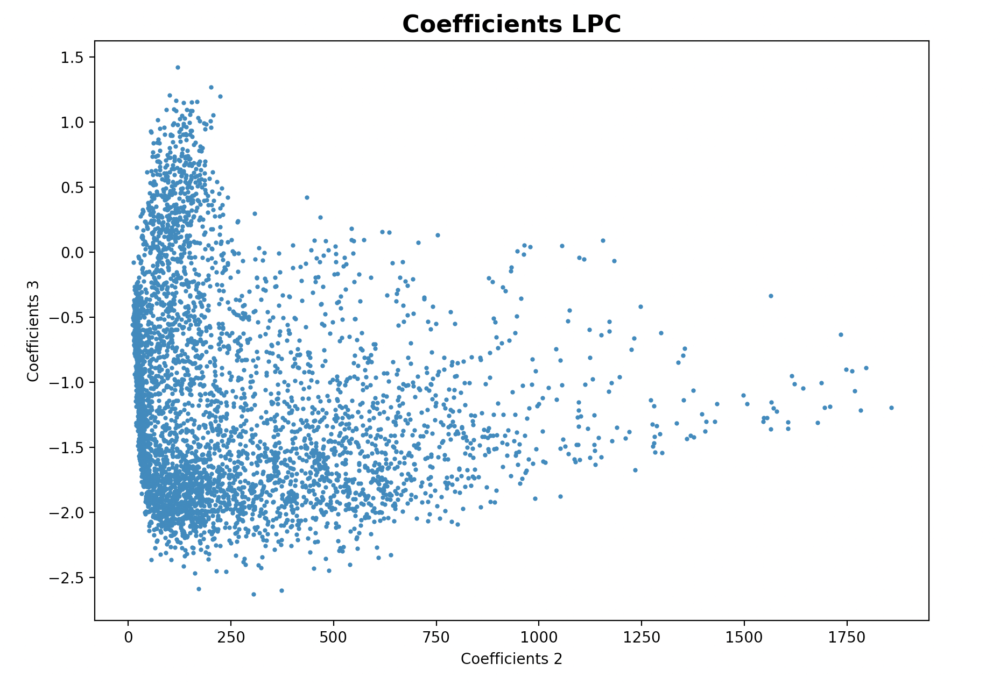
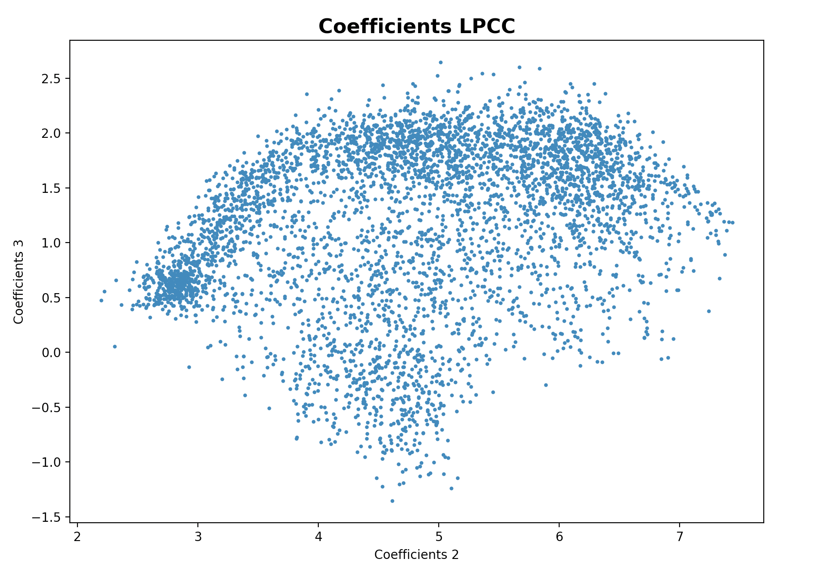
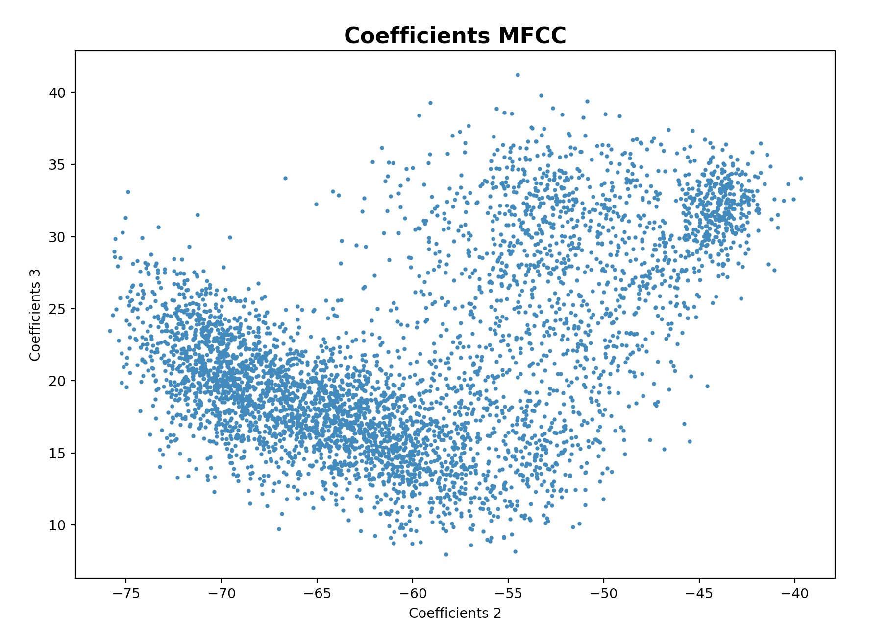
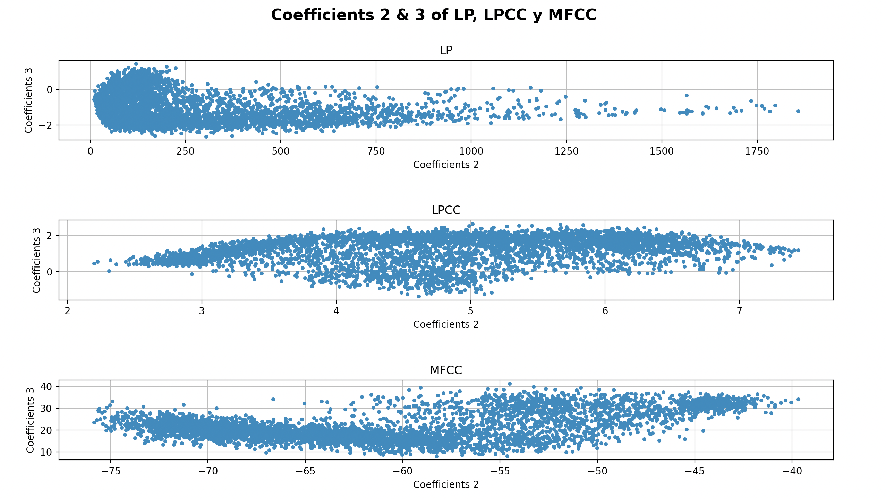
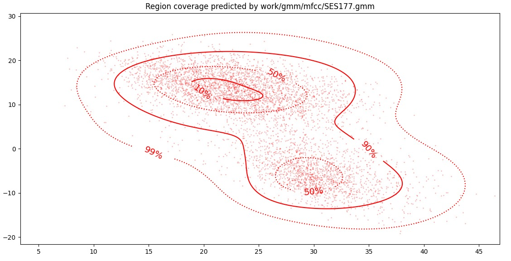
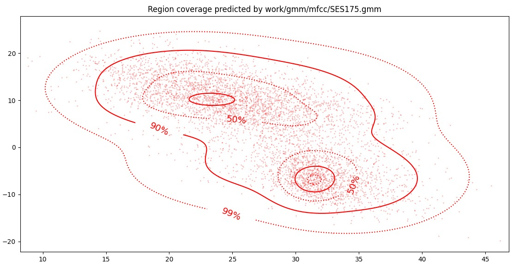
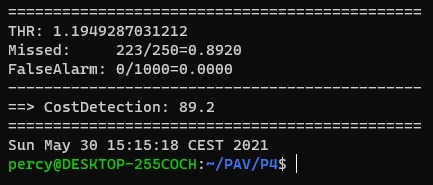
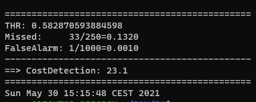
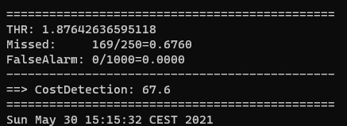

PAV - P4: reconocimiento y verificación del locutor
===================================================

Obtenga su copia del repositorio de la práctica accediendo a [Práctica 4](https://github.com/albino-pav/P4)
y pulsando sobre el botón `Fork` situado en la esquina superior derecha. A continuación, siga las
instrucciones de la [Práctica 2](https://github.com/albino-pav/P2) para crear una rama con el apellido de
los integrantes del grupo de prácticas, dar de alta al resto de integrantes como colaboradores del proyecto
y crear la copias locales del repositorio.

También debe descomprimir, en el directorio `PAV/P4`, el fichero [db_8mu.tgz](https://atenea.upc.edu/pluginfile.php/3145524/mod_assign/introattachment/0/spk_8mu.tgz?forcedownload=1)
con la base de datos oral que se utilizará en la parte experimental de la práctica.

Como entrega deberá realizar un *pull request* con el contenido de su copia del repositorio. Recuerde
que los ficheros entregados deberán estar en condiciones de ser ejecutados con sólo ejecutar:

~~~~~~~~~~~~~~~~~~~~~~~~~~~~~~~~~~~~~~~~~~~~~~~~~~~~~.sh
  make release
  run_spkid mfcc train test classerr verify verifyerr
~~~~~~~~~~~~~~~~~~~~~~~~~~~~~~~~~~~~~~~~~~~~~~~~~~~~~

Recuerde que, además de los trabajos indicados en esta parte básica, también deberá realizar un proyecto
de ampliación, del cual deberá subir una memoria explicativa a Atenea y los ficheros correspondientes al
repositorio de la práctica.

A modo de memoria de la parte básica, complete, en este mismo documento y usando el formato *markdown*, los
ejercicios indicados.

## Ejercicios.

### SPTK, Sox y los scripts de extracción de características.

- Analice el script `wav2lp.sh` y explique la misión de los distintos comandos involucrados en el *pipeline*
  principal (`sox`, `$X2X`, `$FRAME`, `$WINDOW` y `$LPC`). Explique el significado de cada una de las 
  opciones empleadas y de sus valores.
    - sox: con este comando convertimos la señal de entrada a un formato contreto de 'b' bits. Podemos elegir como queremos la señal de entrada, es decir, si queremos añadir o no la cabecera, el formato de la señal o los bits utilizados. 

    - $X2X: esta opción representa el programa SPTK con el que relizamos la conversión entre los distintos formatos de datos.
     ```py
       x2x [+type1][+type2][-r][-o][%format]
     ```
    - FRAME: con este comando dividimos la señal de entrada en tramas de '-l' muestras con desprazamiento de ventana de '-p' muestras. Podemos escoger si queremos el punto de comienzo centrado.

    - WINDOW: con este comando multiplicamos cada trama por una ventana. Podemos escoge el numero de '-L' muestras por trama, el tipo de normalización y el tipo de ventana a utilzar.

    - LPC: con este comando calculamos los coeficientes de predicción lineal, 'lpc_order'. Podemos escoger el numero de '-l' tramas, el orden el LPC (-m), y el valor minimo del determinante de la matriz normal. 

- Explique el procedimiento seguido para obtener un fichero de formato *fmatrix* a partir de los ficheros de
  salida de SPTK (líneas 45 a 47 del script `wav2lp.sh`).
  
  > Primero extraemos las caracteristicas necesarias de la señal de entrada, a partir de los comandos comentados anteriormente:

  ```sh
       # Main command for feature extration
          sox $inputfile -t raw -e signed -b 16 - | $X2X +sf | $FRAME -l 240 -p 80 | $WINDOW -l 240 -L 240 | $LPC -l 240 -m $lpc_order > $base.lp
     ```
  
  > El fichero *fmatrix* esta compuesto por número de filas y de columnas seguidos por los datos.
  
  >El numero de columnas es igual al número de coeficientes, calculado como *lp_order +1*; en el primer elemento del vector es donde se almacena la ganancia de predicción.
  
  >El número de filas es igual al número de tramas. Este número depende de las caractericas de la señal de entrada, por lo tanto tenemos que parametrizar la señal para convertirla en texto, usando *+fa*, y contando el número de líneas, con el comando de *UNIX wc -l*.

  ```sh
       # Our array files need a header with the number of cols and rows:
        ncol=$((lpc_order+1)) # lpc p =>  (gain a1 a2 ... ap) 
        nrow=`$X2X +fa < $base.lp | wc -l | perl -ne 'print $_/'$ncol', "\n";'`
     ```

  * ¿Por qué es conveniente usar este formato (u otro parecido)? Tenga en cuenta cuál es el formato de
    entrada y cuál es el de resultado.

    > De esta forma podremos ver a la salida el valor de los coeficientes en cada trama, siendo cada columna el valor de cada coeficiente y cada fila el número de trama. Por lo tanto, a partir de este formato matriz es mucho más fácil acceder, observar y extraer los datos de la trama.

- Escriba el *pipeline* principal usado para calcular los coeficientes cepstrales de predicción lineal
  (LPCC) en su fichero <code>scripts/wav2lpcc.sh</code>:

    > En el caso del LPC2C transformamos los LPC a coeficientes cepstrales. 

  ```sh
       # Main command for feature extration:
        sox $inputfile -t raw -e signed -b 16 - | $X2X +sf | $FRAME -l 240 -p 80 | $WINDOW -l 240 -L 240 | $LPC -l 240 -m $lpc_order | $LPC2C -m $lpc_order -M $nceps > $base.lpcc
     ```

- Escriba el *pipeline* principal usado para calcular los coeficientes cepstrales en escala Mel (MFCC) en su
  fichero <code>scripts/wav2mfcc.sh</code>:

    > En este caso analizamos el MFCC. 

  ```sh
       # Main command for feature extration:
        sox $inputfile -t raw -e signed -b 16 - | $X2X +sf | $FRAME -l 240 -p 80 | $MFCC -s 8000 -n $ncoef -l 240 -m $mfcc_order > $base.mfcc
     ```

### Extracción de características.

- Inserte una imagen mostrando la dependencia entre los coeficientes 2 y 3 de las tres parametrizaciones
  para todas las señales de un locutor.

  > Primero, vamos a representar las dependencias de las tres parametrizaciones por separado para observar las dependencias más detalladamente:

  + Indique **todas** las órdenes necesarias para obtener las gráficas a partir de las señales 
    parametrizadas.

  <code>fmatrix_show work/lp/BLOCK17/SES177/*.lp | egrep '^[' | cut -f3,4 > lp_2_3.txt</code>

  

  <code>fmatrix_show work/lpcc/BLOCK17/SES177/*.lpcc | egrep '^[' | cut -f3,4 > lpcc_2_3.txt</code>

  
    ```ssh
        fmatrix_show work/mfcc/BLOCK17/SES177/*.mfcc | egrep '^[' | cut -f3,4 > mfcc_2_3.txt</code>
    ```

  

  > A continuación, representamos las dependencias de las tres parametrizaciones conjuntamente para ver las diferencias:

  

  + ¿Cuál de ellas le parece que contiene más información?

    > Para ver que represntación contiene más información, tenemos que fijarnos en lo correlados que están los coeficientes entre si. Si tenemos coeficientes muy correlados, carecen de información útil ya que ambos coeficientes nos van a dar la misma información. En cambio, si tenemos coeficientes muy incorrelados, obtenedremos valores distintos y esto nos aportará más información.
    
    Podemos comprobar que la representación a partir del MFCC, la información es la más dispersa de las tres y vemos que es el que tiene más márgen dinámico, por lo tanto es la representación que más información nos aporta. En cambio, la representación LP y LPCC nos porta la casi la misma información, ambas representaciones tienen un conjunto elevado de valores muy correlados y otro conjunto más incorrelado. 

- Usando el programa <code>pearson</code>, obtenga los coeficientes de correlación normalizada entre los
  parámetros 2 y 3 para un locutor, y rellene la tabla siguiente con los valores obtenidos.

  > Utilizamos la orden:
    ```sh
        pearson work/lp/BLOCK17/SES177/*.lp | fgrep [2][3]
        pearson work/lpcc/BLOCK17/SES177/*.lp | fgrep [2][3]
        pearson work/mfcc/BLOCK17/SES177/*.lp | fgrep [2][3]
    ```

  |                        | LP       | LPCC     | MFCC       |
  |------------------------|:--------:|:--------:|:----------:|
  | &rho;<sub>x</sub>[2,3] | -0.69082 |-0.588743 | 0.145828   |
  
  + Compare los resultados de <code>pearson</code> con los obtenidos gráficamente.
        
        > Los resultados son lo que esperábamos. Sabemos que cuando ρ≈1 los coeficientes son más correlados, en nuestro caso, el método que más correlación entre coeficientes nos da es el LP.  Mientras que para ρ≈0 los coeficientes son más incorrelados, en nuestro caso, el método que nos da más incorrelación entre coeficientes es el MFCC, por lo tanto es nuestro mejor método para la extracción de características. 
  
- Según la teoría, ¿qué parámetros considera adecuados para el cálculo de los coeficientes LPCC y MFCC?

    > Según la teoría, para el reconocimiento del habla se suelen escoger aproximadamente unos 13 coeficientes y 25 bancos de filtro.

### Entrenamiento y visualización de los GMM.

Complete el código necesario para entrenar modelos GMM.

- Inserte una gráfica que muestre la función de densidad de probabilidad modelada por el GMM de un locutor
  para sus dos primeros coeficientes de MFCC.

  > Utilizamos la orden:
    ```sh
        plot_gmm_feat work/gmm/mfcc/SES177.gmm work/mfcc/BLOCK17/SES177/SA177S* -x1 -y2 -p 99,90,50,10</code>
    ```

    
  
- Inserte una gráfica que permita comparar los modelos y poblaciones de dos locutores distintos (la gŕafica
  de la página 20 del enunciado puede servirle de referencia del resultado deseado). Analice la capacidad
  del modelado GMM para diferenciar las señales de uno y otro.

  > Utilizamos las ordenes:

    ```sh
        plot_gmm_feat work/gmm/mfcc/SES177.gmm work/mfcc/BLOCK17/SES177/SA177S* -x1 -y2 -p 99,90,50,10
        plot_gmm_feat work/gmm/mfcc/SES175.gmm work/mfcc/BLOCK17/SES175/SA175S* -x1 -y2 -p 99,90,50,10
    ```

    
    


### Reconocimiento del locutor.

Complete el código necesario para realizar reconociminto del locutor y optimice sus parámetros.

- Inserte una tabla con la tasa de error obtenida en el reconocimiento de los locutores de la base de datos
  SPEECON usando su mejor sistema de reconocimiento para los parámetros LP, LPCC y MFCC.

  |            | LP       | LPCC     | MFCC       |
  |------------|:--------:|:--------:|:----------:|
  | nerr       |    86    |    17    |      5     |
  |------------|:--------:|:--------:|:----------:|
  | ntot       |   785    |   785    |    785     |
  |------------|:--------:|:--------:|:----------:|
  | error_rate |  10.96%  |   2.17%  |    0.64%   |

  

  > Podemos ver que que el mejor sistema de reconocimeniento en nuestro caso es el MFCC, ya que es el que nos da la menor tasa de error.

### Verificación del locutor.

Complete el código necesario para realizar verificación del locutor y optimice sus parámetros.

- Inserte una tabla con el *score* obtenido con su mejor sistema de verificación del locutor en la tarea
  de verificación de SPEECON. La tabla debe incluir el umbral óptimo, el número de falsas alarmas y de
  pérdidas, y el score obtenido usando la parametrización que mejor resultado le hubiera dado en la tarea
  de reconocimiento.

  |                | LP              | MFCC            | LPCC              |
  |----------------|:---------------:|:---------------:|:-----------------:|
  | THR            | 1.1949287031212 | 1.87642636595118| 0.582870593884598 |
  | Missed         |  223/250=0.8920 |  169/250=0.6760 |     33/250=0.1320 |
  | False Alarm    |   0/1000=0.0000 |   0/1000=0.0000 |     1/1000=0.0010 |
  | Cost Detection |            89.2 |            67.6 |              23.1 |
 
    >LP
    
    >LPCC
    
    >MFCC
    
    
    > Podemos ver que que el mejor sistema de verificación en nuestro caso es el LPCC, ya que es el que nos da el menor Umbral, Perdidas, Falsas Alarmas y Coste de Detección.

### Test final

- Adjunte, en el repositorio de la práctica, los ficheros `class_test.log` y `verif_test.log` 
  correspondientes a la evaluación *ciega* final.

### Trabajo de ampliación.

- Recuerde enviar a Atenea un fichero en formato zip o tgz con la memoria (en formato PDF) con el trabajo 
  realizado como ampliación, así como los ficheros `class_ampl.log` y/o `verif_ampl.log`, obtenidos como 
  resultado del mismo.
